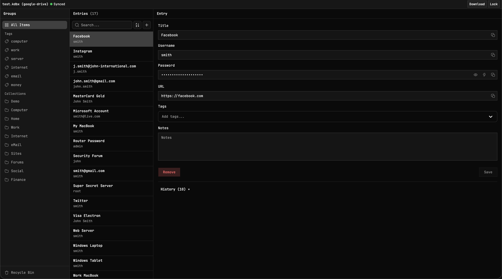

# keeweb-lite

keeweb-lite is a lightweight, web-only password manager inspired by [KeeWeb](https://github.com/keeweb/keeweb). It stays intentionally small and practical: static app, client-side only, and focused on core vault workflows.



## Features

- Two source types only: `Local` and `Google Drive`.
- Unlock with password and optional key file.
- Key file stays in runtime memory during unlock flow.
- Google Drive records sync after every change.
- No settings/options UI; behavior is fixed by design.
- KeeWeb-like workspace layout: groups, tags, entry list, and details editor.
- Built-in password generator in entry editing flow.
- Native KDBX entry history with apply/restore workflow.
- Remove and restore entries with recycle-bin behavior.
- Download current encrypted `.kdbx` at any time.
- Mobile-friendly layout for unlock and workspace flows.
- Auto-lock after inactivity.

## Requirements

- Node.js `>= v24.13.0`
- npm `>= 11.9.0`

## Scripts

```bash
npm run dev          # Start Astro dev server
npm run build        # Build production output
npm run preview      # Preview production build

npm run check        # Astro diagnostics and type-checking
npm run test         # Run unit tests
npm run test:watch   # Run unit tests in watch mode

npm run lint         # ESLint check
npm run lint:fix     # ESLint fix

npm run csslint      # Stylelint check
npm run csslint:fix  # Stylelint fix

npm run format       # Prettier check
npm run format:fix   # Prettier write
```

## Resources

- Feature specs: [docs/features](docs/features/)
- Screen specs: [docs/screens](docs/screens/)
- Screenshots: [workspace](images/workspace.png), [unlock](images/unlock.png), [workspace mobile](images/workspace-mobile.png), [unlock mobile](images/unlock-mobile.png)

## Google Drive Setup

To enable Google Drive integration, you need a Google Cloud project with OAuth 2.0 credentials.

### 1. Create a Google Cloud Project

1. Go to [Google Cloud Console](https://console.cloud.google.com) and create a project.
2. In **APIs & Services -> Library**, enable **Google Drive API**.

### 2. Configure OAuth Consent Screen

1. Go to **APIs & Services -> OAuth consent screen**.
2. Set **User type** to **External**.
3. Fill required app information.
4. In scopes, add `https://www.googleapis.com/auth/drive.file`.
5. While publishing status is **Testing**, add your account as a test user.

### 3. Create OAuth 2.0 Credentials

1. Go to **APIs & Services -> Credentials -> Create -> OAuth 2.0 Client ID**.
2. Set **Application type** to **Web application**.
3. Add authorized JavaScript origins:
   - `http://localhost:4321`
   - Your production origin
4. Put the client ID in `.env`:

```env
PUBLIC_GOOGLE_CLIENT_ID=your-client-id
```

## License

[MIT](LICENSE)
